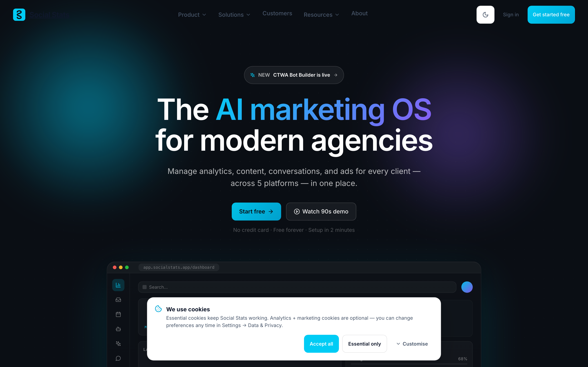

# Social Stats — Open-Source Social Media Management & Marketing Platform

> An open-source, self-hostable alternative to Hootsuite, Buffer & Sprout Social.

**Social Stats** is an open-source **social media management** and marketing platform for
agencies and teams. One product unifies a **social media scheduler** and **content calendar**,
cross-platform **analytics dashboards**, a unified conversation inbox, a click-to-WhatsApp
**bot builder**, and an **AI social media assistant** — across **Facebook**, **Instagram**,
**YouTube**, **LinkedIn**, and **Google Business**, with WhatsApp Business as a first-class
messaging module. It's built on **Django + React** and is fully self-hostable.

<!-- Badges — replace `cbsshekhawat18` with your GitHub org/username if different,
     and the repo slug if you don't use `social-stats-social-media-manager`. -->
[](https://github.com/cbsshekhawat18-lab/social-stats-social-media-manager/actions/workflows/tests.yml)
[](./LICENSE)
[](https://github.com/cbsshekhawat18-lab/social-stats-social-media-manager/stargazers)
[](https://github.com/cbsshekhawat18-lab/social-stats-social-media-manager/commits)
[](./CONTRIBUTING.md)

> **Status:** early-stage. The product is feature-complete enough to run
> end-to-end (auth, OAuth onboarding, analytics, composer, AI features,
> CTWA bot builder, marketplace), but customer-volume, testimonials, and
> case studies on the marketing site are intentionally absent until we
> onboard the first cohort of launch partners.

> ⭐ **If Social Stats is useful to you, please star the repo** — it helps other
> people building self-hosted social tooling find the project.

---

## Demo

Spin up a fully-seeded local instance in two commands:

```bash
python manage.py migrate
python manage.py demo_setup    # seeds 3 accounts + 90 days of sample analytics
```

`demo_setup` is idempotent and creates three accounts (password `demo` for all),
then chains into the sample-data seeder so the dashboards aren't empty. Sign in at
`/login`, which surfaces one-click sign-in buttons for each:

| Account | Email | Password | Lands on |
|---|---|---|---|
| Superadmin | `admin@demo.local` | `demo` | `/admin` |
| Agency member | `agency@demo.local` | `demo` | `/dashboard` + `/agency/*` |
| End user | `enduser@demo.local` | `demo` | `/u` |

> These are local-only demo credentials — never deploy them to a real environment.



> 📸 _Screenshot placeholder._ Capture a real shot or GIF of the analytics dashboard
> and save it to `docs/screenshot.png` — a live screenshot dramatically increases
> click-through and stars. (See "Add a screenshot" in `CONTRIBUTING.md`.)

---

## Documentation

Full guides live in [`docs/`](docs/):

- [Getting Started](docs/GETTING_STARTED.md) — zero to running locally
- [Configuration](docs/CONFIGURATION.md) — every `.env` variable explained
- [Connect Social Accounts](docs/CONNECT_ACCOUNTS.md) — Meta, Google, LinkedIn (exact scopes & redirect URIs)
- [Connect WhatsApp](docs/CONNECT_WHATSAPP.md) — Pinbot / WABA + webhook setup
- [Going Live](docs/GOING_LIVE.md) — platform app-review & production checklist
- [User Guide](docs/USER_GUIDE.md) — the three account types and every module
- [FAQ & Troubleshooting](docs/FAQ_TROUBLESHOOTING.md) — common failures and fixes
- [How it compares](docs/COMPARISON.md) — vs. closed-source SaaS tools

---

## Features

- **Social media scheduling & content calendar** — one composer with per-platform
  formatting, brand-voice AI captions, scheduling, and approval flows for agency clients.
- **Analytics dashboard** — daily-metric ingestion across 5 platforms, a time-series
  API, per-client dashboards, and AI-narrated monthly reports.
- **Unified inbox** — one conversation queue across DMs, comments, and Google
  reviews, with AI reply suggestions in your brand voice.
- **Click-to-WhatsApp bot builder** — a visual flow editor with conditional branches
  and AI chat nodes; lead capture pushes to your CRM.
- **Agency marketplace** — a two-sided agency directory where end users can find an
  agency to manage their workspace.
- **AI assistant** — a Cmd/Ctrl+J assistant with tool use, brand-voice training,
  insights, and forecasts (powered by Anthropic Claude).

### Account types

| Account | What they see |
|---|---|
| `superadmin` / `staff` | Full admin shell at `/admin` |
| Agency member (`role=client`, `account_type=agency_member`) | Shared dashboard at `/dashboard` + agency-only management at `/agency/*` |
| End user (`role=client`, `account_type=end_user`) | End-user shell at `/u` + a single workspace they own |

---

## Who is it for?

- **Social media agencies** managing many client brands from one place, with per-client workspaces, granular permissions, and approval flows.
- **In-house marketing teams** running several brand/social accounts who want scheduling, analytics, and a shared inbox without per-seat SaaS fees.
- **Solo creators & small businesses** who want a free, self-hosted tool to plan posts, track growth, and reply to messages across platforms.
- **Developers** who want a customizable, MIT-licensed Django + React base they can self-host and extend.

## How it works

1. **Connect accounts** — link Facebook, Instagram, YouTube, LinkedIn, Google Business, and WhatsApp via OAuth or the in-app manual setup wizard. Tokens are encrypted at rest, per workspace. See [docs/CONNECT_ACCOUNTS.md](docs/CONNECT_ACCOUNTS.md).
2. **Plan & publish** — draft once in the composer, format per platform, schedule on the content calendar; agency posts can route through client approval.
3. **Engage** — DMs, comments, and Google reviews land in one unified inbox with AI-suggested replies; build automated WhatsApp/CTWA bot flows.
4. **Measure** — Celery syncs daily metrics into per-client analytics dashboards, with AI-narrated monthly reports.
5. **Self-host** — run it on your own infrastructure (Django + DRF + Celery + Postgres + React); you own the data and the keys.

## How it compares

An honest, structural comparison vs. closed-source SaaS tools (Hootsuite, Buffer,
Sprout Social). Social Stats is early-stage; this compares licensing/hosting and
the feature categories it actually ships — see [docs/COMPARISON.md](docs/COMPARISON.md)
for the full picture.

| | **Social Stats** | Closed SaaS |
|---|---|---|
| License | **Open source (MIT)** | Proprietary |
| Hosting | **Self-host, own your data** | Vendor cloud only |
| Source code | **Public & forkable** | Closed |
| Cost | **Free to self-host** | Paid subscription |
| Platform coverage | FB, IG, YouTube, LinkedIn, Google Business + WhatsApp | Varies by plan |
| Maturity / support | Early-stage, community | Mature, commercial SLAs |

---

## Tech stack

| Layer | What |
|---|---|
| Backend | Django 4.2 + Django REST Framework |
| Auth | JWT (SimpleJWT) + Argon2 hasher + django-axes brute-force protection |
| Task queue | Celery + Redis |
| Realtime | Django Channels (WebSockets) |
| Database | SQLite for local dev, PostgreSQL for everything else |
| Encryption | Fernet for OAuth tokens at rest |
| AI | Anthropic Claude (captions, replies, insights, assistant) |
| Frontend | React 18 + React Router v6 |
| Data fetching | TanStack Query + Zustand |
| Animations | framer-motion |
| Charts | Recharts |
| Icons | lucide-react |

---

## Self-hosting / installation (local dev)

You'll need: Python 3.11+, Node 18+, Redis, and an Anthropic API key for AI
features (everything else works without external credentials).

### Backend

```bash
cd backend
python -m venv .venv && source .venv/bin/activate
pip install -r requirements.txt

# Configure env
cp .env.example .env
# Edit .env — at minimum set ANTHROPIC_API_KEY if you want AI features.

# Migrate the schema
python manage.py migrate

# (Optional, but recommended for first-time evaluation)
# Seed three demo accounts + 90 days of analytics data so the dashboards
# aren't empty. Prints the demo credentials on stdout.
python manage.py demo_setup

# Run
python manage.py runserver
```

### Frontend

```bash
cd frontend
npm install
cp .env.example .env
npm start
# http://localhost:3000
```

### Celery (background sync + notifications)

In two extra terminals:

```bash
# worker
cd backend && source .venv/bin/activate
celery -A dashboard worker -l info

# beat (scheduled tasks)
cd backend && source .venv/bin/activate
celery -A dashboard beat -l info --scheduler django_celery_beat.schedulers:DatabaseScheduler
```

### Redis

```bash
# macOS
brew install redis && brew services start redis

# Ubuntu / Debian
sudo apt install redis-server && sudo systemctl start redis

# Docker
docker run -d -p 6379:6379 redis
```

---

## OAuth setup

To connect real social-platform accounts during local dev, you need OAuth
credentials. Each platform requires its own app:

- **Meta (Facebook + Instagram)** — `https://developers.facebook.com` → Create
  App → Business type → Pages API + Instagram Graph API. Add redirect URI
  `http://localhost:8000/api/oauth/facebook/callback/`.
- **Google (YouTube + Google Business)** — `https://console.cloud.google.com` →
  enable YouTube Data API v3, YouTube Analytics API, Business Profile API. Add
  redirect URI `http://localhost:8000/api/oauth/google/callback/`.
- **LinkedIn** — `https://www.linkedin.com/developers` → request Marketing
  Developer Platform. Add redirect URI
  `http://localhost:8000/api/oauth/linkedin/callback/`.

Drop the resulting `*_CLIENT_ID` / `*_CLIENT_SECRET` values into `backend/.env`.
Without these, the connect-account flows in Settings will redirect but fail at
the platform-consent step; everything else (composer drafts, AI features,
preview pages) still works.

---

## Project layout

```
social-stats/
├── backend/                     Django + DRF
│   ├── dashboard/               Project config (settings, urls, celery)
│   └── social_stats/            Main app
│       ├── models.py            Client, UserProfile, PlatformCredential,
│       │                        DailyMetric, Agency, HashtagSet, UnifiedPost, …
│       ├── views.py             REST viewsets
│       ├── oauth_views.py       OAuth flows for the 5 platforms
│       ├── ai/                  Prompts + context builders
│       ├── security/            MFA, sessions, login monitor, throttles
│       └── tasks.py             Celery sync + notification tasks
├── frontend/
│   └── src/
│       ├── App.js               Routes + Protected wrapper
│       ├── components/
│       │   ├── shell/           AppShell, ModuleRail, TopBar, FeatureSidebar
│       │   ├── marketing/       MarketingLayout + landing-page sections
│       │   └── ui/              Button, Modal, Drawer, Tooltip, AccountTypeBadge…
│       ├── pages/               Routed page components
│       ├── hooks/               useAuth, useTheme, useRealtime, useBreakpoint
│       ├── services/            api.js, platforms.js, queryClient
│       └── styles/              tokens.css (design tokens), theme.js
├── infra/                       Terraform + Nginx examples
├── scripts/                     deploy_prod.sh, verify-backups.sh, …
└── templates/                   Breach-notification + regulatory templates
```

---

## Production deployment

```bash
# Build the React bundle
cd frontend && npm run build

# Production env
# DEBUG=False
# ALLOWED_HOSTS=yourdomain.com
# DATABASE_URL=postgres://…
# REDIS_URL=redis://…
# ANTHROPIC_API_KEY=…
# EMAIL_HOST_PASSWORD=…
# FIELD_ENCRYPTION_KEYS=…
# FACEBOOK_CONSUMER_REDIRECT_URI=https://yourdomain.com/api/oauth/facebook/consumer/callback/
# FRONTEND_URL=https://yourdomain.com

# Run
cd backend && gunicorn dashboard.wsgi:application --bind 0.0.0.0:8000 --workers 4
```

An example Nginx config lives in `infra/nginx/`. A skeleton Terraform module
covering VPC, RDS, KMS, and GuardDuty is at `infra/terraform/`. Both are
starting points — adapt to your environment.

---

## Contributing

Social Stats is an open codebase and PRs are welcome — see
[CONTRIBUTING.md](./CONTRIBUTING.md) and our
[Code of Conduct](./CODE_OF_CONDUCT.md). Good areas to start:

- New platform integrations (any of the major social or messaging APIs)
- Translations for marketing pages
- Accessibility (a11y) improvements
- Test coverage in the React app

The backend has 267 tests (`python manage.py test social_stats`); the frontend
has Jest tests (`CI=true npm test`). Both should stay green.

⭐ **Starring the repo is the single easiest way to help** — it raises visibility
for everyone else looking for an open-source social media management tool.

---

## Author & Credits

**Social Stats** is built and maintained by **Chandrabhan Shekhawat** —
**Gigai Kripa Services**.

- 🌐 Website: <https://gigaikripaservices.com/>
- 👤 Author: Chandrabhan Shekhawat
- 🏢 Company: Gigai Kripa Services
- © 2026 Chandrabhan Shekhawat — Gigai Kripa Services

If you use Social Stats in your own project or product, a credit back to the
author / this repository is appreciated. ⭐ Stars help others find it.

---

## License

Released under the **[MIT License](./LICENSE)** — free to use, modify, and
self-host, for individuals and companies alike.

```
Copyright (c) 2026 Chandrabhan Shekhawat — Gigai Kripa Services
```

---

## Security

For responsible disclosure, see [SECURITY.md](./SECURITY.md). Please don't open
public issues for security reports.
